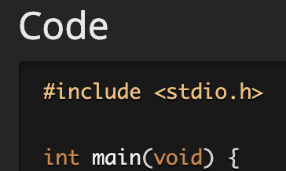

# Task 7: Get a status badge

You are going to update this web page: `https://csci3251-2020.github.io/(repo name)` 

Go through these steps:
1. Edit readme.md, and include the code from *`code.c`* using `include_relative`
2. Highlight the code using C syntax highlighting with markdown, like this:
* 
3. Now you should get a workflow status badge for the code, as in this document: https://help.github.com/en/actions/configuring-and-managing-workflows/configuring-a-workflow#adding-a-workflow-status-badge-to-your-repository
* The code should already be well prepared in Task 6
* The *owner* is _csci3251-2020_, and the *repository* is your team repo name
* You can find the *workflow name* in the first line in `.github/workflows/ccpp.yml`, yet please edit the name there so it has no space and shows something about your group
4. Insert the resultant image using markdown, under the code snipplet you inserted

_You may find this page useful: https://jekyllrb.com/docs/includes/_
